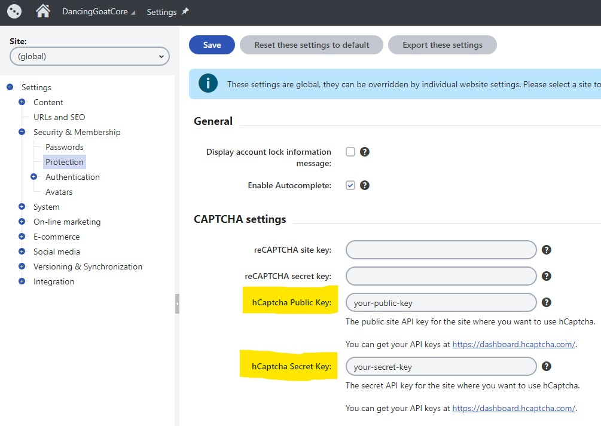
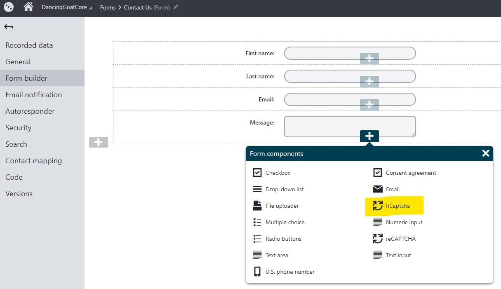

# Xperience Cloudflare Turnstile

[](https://github.com/wiredviews/xperience-cloudflare-turnstile/actions/workflows/ci.yml)

[](https://github.com/wiredviews/xperience-cloudflare-turnstile/actions/workflows/publish.yml)

Cloudflare Turnstile is a privacy-preserving alternative to traditional captchas that can be used independently of any of Cloudflare's other products and services. Xperience Cloudflare Turnstile integrates Turnstile's visitor validation into Kentico Xperience 13.0 Form Builder forms.

> You can take advantage of Turnstile and stop bothering your visitors with a CAPTCHA even without being on the Cloudflare network. While we make it as easy as possible to use our network, we don't want this to be a barrier to improving privacy and user experience. - [source](https://blog.cloudflare.com/turnstile-private-captcha-alternative/)

## Packages

### XperienceCommunity.Cloudflare.Turnstile

[](https://www.nuget.org/packages/XperienceCommunity.Cloudflare.Turnstile)

Kentico Xperience 13.0.66 (or higher) ASP.NET Core 6.0+ Form Component that adds [Cloudflare Turnstile](https://blog.cloudflare.com/turnstile-private-captcha-alternative/) "captcha alternative" validation to Form Builder forms.

### XperienceCommunity.Cloudflare.Turnstile.CMS

[](https://www.nuget.org/packages/XperienceCommunity.Cloudflare.Turnstile.CMS)

Kentico Xperience 13.0.66 (or higher) CMS installation module that adds [Cloudflare Turnstile](https://blog.cloudflare.com/turnstile-private-captcha-alternative/) settings keys to the Settings application.

## How to Use?

1. Install the `XperienceCommunity.Cloudflare.Turnstile` NuGet package in your ASP.NET Core 6.0+ application:

   ```bash
   dotnet add package XperienceCommunity.Cloudflare.Turnstile
   ```

1. Install the `XperienceCommunity.Cloudflare.Turnstile.CMS` NuGet package in your CMS application:

   ```bash
   dotnet add package XperienceCommunity.Cloudflare.Turnstile.CMS
   ```

## Usage

1. Add a registration for the `TurnstileInstallerModule` in your `CMSApp` project:

   ```csharp
   using XperienceCommunity.Cloudflare.Turnstile.CMS

   [assembly: RegisterModule(typeof(TurnstileInstallerModule))]

   namespace CMSApp.Configuration
   {
      public class DependencyRegistrations
      {

      }
   }
   ```

   On application startup, custom CMS settings will be added to the Settings application

1. Set the settings keys in the CMS Settings application with the values provided in your [Cloudflare Dashboard](https://dash.cloudflare.com/).

   

1. Add the Cloudflare Turnstile Form Component to a Form Builder form.

   

1. Configure any properties on the Turnstile component

   

1. Load the form on your live site and test out the form submission! 💪

## Contributions

If you discover a problem, please [open an issue](https://github.com/wiredviews/xperience-cloudflare-turnstile/issues/new).

If you would like contribute to the code or documentation, please [open a pull request](https://github.com/wiredviews/xperience-cloudflare-turnstile/compare).

## References

### Cloudflare Turnstile

- [Cloudflare Turnstile](https://blog.cloudflare.com/turnstile-private-captcha-alternative/)
- [Turnstile Server Configuration](https://developers.cloudflare.com/turnstile/get-started/server-side-validation/)
- [Turnstile Client Configuration](https://developers.cloudflare.com/turnstile/get-started/client-side-rendering/)
- [Cloudflare Dashboard](https://dash.cloudflare.com/)

### Related

- [Xperience hCaptcha](https://github.com/wiredviews/xperience-hcaptcha)

### Kentico Xperience

- [Form Components](https://docs.xperience.io/x/pQ2RBg)
